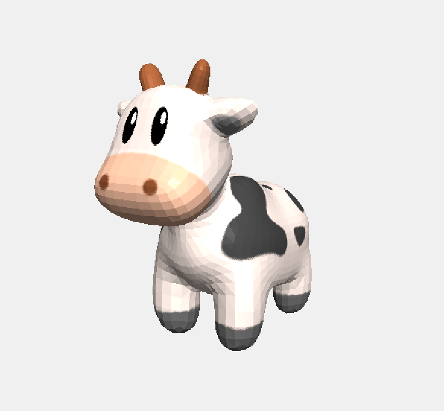
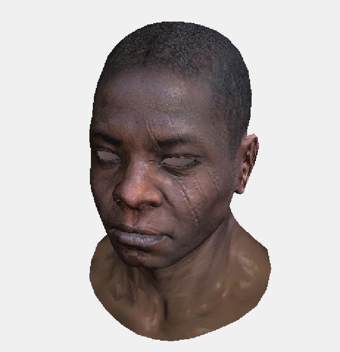
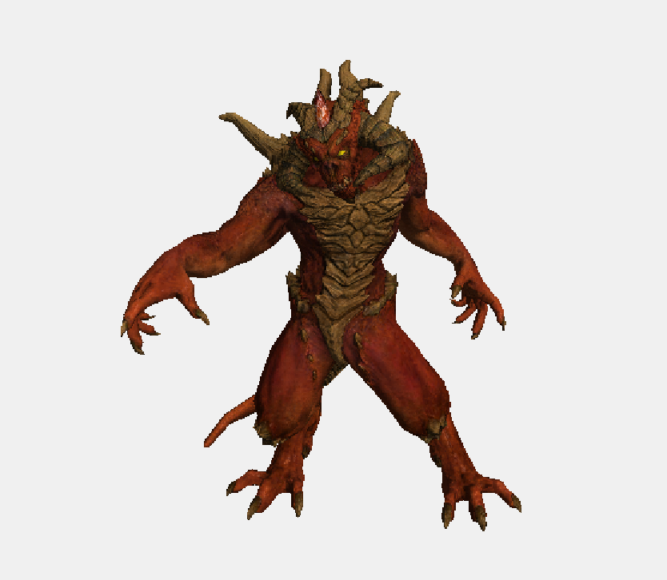

# Renderer

A software rasterization renderer developed with C++ and Qt, capable of loading and rendering 3D models with realistic lighting effects using the Phong shading algorithm.

## Rendering Showcase

## Technical Features

- **Phong Shading**: Implementation of ambient, diffuse, and specular reflection in the Phong shading model
- Perspective correct interpolation

### Prerequisites

- C++ compiler (supporting C++11 or higher)
- Qt framework (Qt5 or higher recommended)
- CMake (3.10 or higher)

## Implementation Details

This renderer uses a custom math library to implement 3D graphic transformations, including view transformations, projection transformations, etc. The rendering process is based on software rasterization, using the Z-buffer algorithm to ensure correct occlusion relationships.

The lighting model uses Phong shading, supporting ambient light, diffuse reflection, and specular reflection, making the rendered models have more realistic lighting effects. Combined with normal maps and specular maps, more realistic material representation can be achieved.

## Build
you can clone this repository and build with QT6.2.4

## Reference
SunXLei's implementation of [SRender](https://github.com/SunXLei/SRender)
